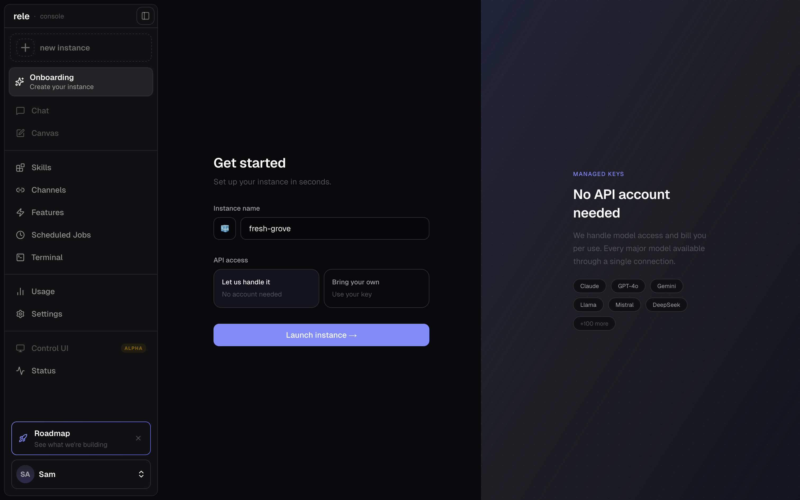
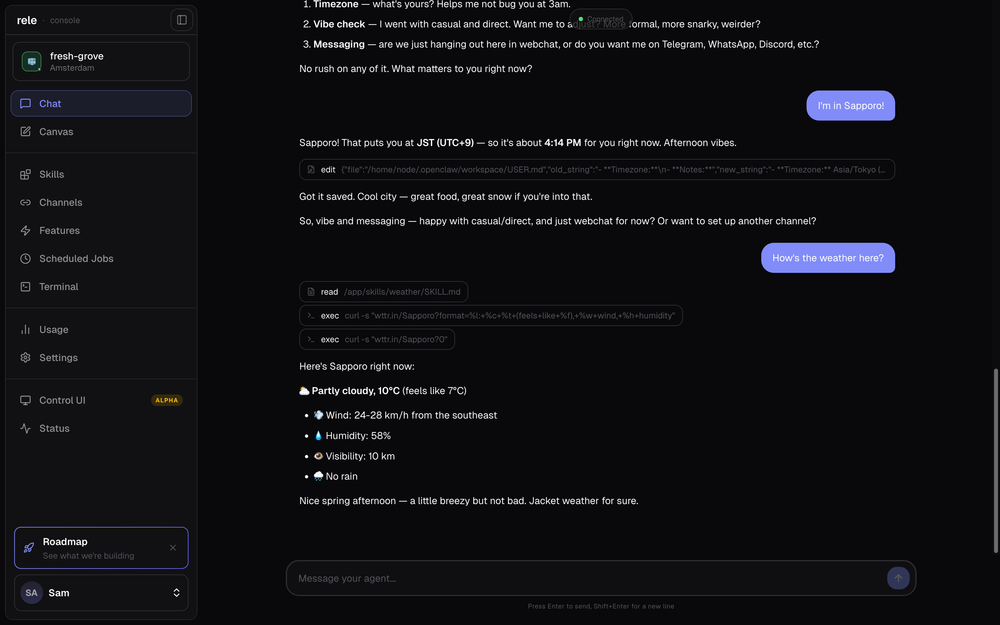
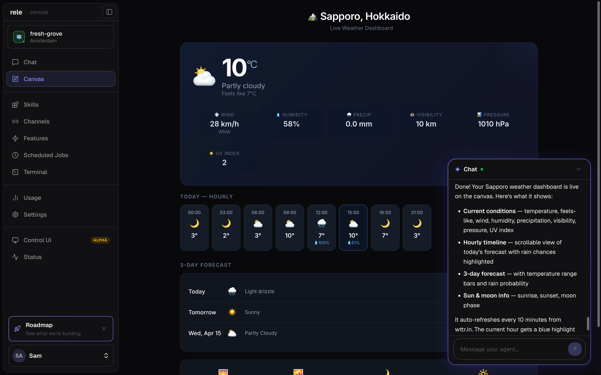

# rele

Deploy and manage OpenClaw instances from a single dashboard. Bring your own API keys or use managed keys — no setup required.

## Screenshots

**Onboarding** — create a new instance, choose managed keys or BYOK



**Chat** — talk to your agent



**Canvas** — agents build and display live artifacts



**Control UI** — the underlying OpenClaw control panel


## Stack

- **web** — Next.js + Neon Auth, hosted on Vercel
- **gate** — Hono/Bun API with JWT validation, hosted on Fly.io
- **db** — Drizzle ORM + Neon PostgreSQL

## Development

```bash
bun install
bun run env:pull   # pull secrets from config repo
bun run dev        # start web + gate
```

Other commands:

```bash
bun run dev:gate              # gate only
bun run build:gate            # build for production
bun run --filter db push      # sync schema to dev DB
bun run --filter db push:prod # sync schema to prod DB
```

## How It Works

Each user gets a dedicated OpenClaw instance running on Fly.io. The gate manages instance lifecycle via the Fly Machines API, tracks state in Neon, and streams real-time stats over WebSocket. A sidecar proxy on each instance handles JWT auth and injects rele branding into the OpenClaw UI.

## Database

Two Neon branches: `main` (production) and `dev` (local). Push schema changes before deploying.
